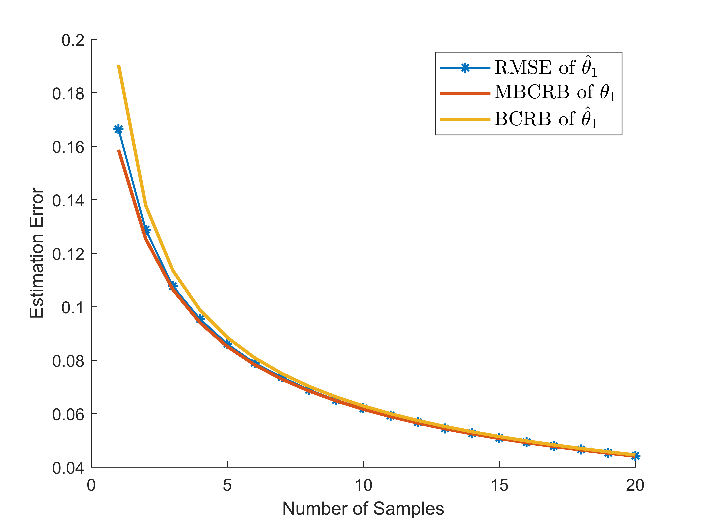

# Misspecified Bayesian Cramér–Rao Bound (MBCRB)

The Misspecified Bayesian Cramér–Rao Bound (MBCRB) is a Bayesian version of the CRB for mismatched models. Model misspecification occurs when the assumed model used to formulate the estimator differs from the true model that generates the data. In such cases, the estimator is no longer an unbiased estimator of the true parameter, but rather an unbiased estimator with respect to the so-called *pseudotrue* parameter. Traditional bounds like the CRB are not effective in lower bounding the error under these conditions. Instead, the estimation error is bounded by the MBCRB.  

- In this work, we extend the MCRB to the Bayesian case, allowing for model misspecification in the prior information.  

The figure below illustrates the bounds and experimental RMSEs under model misspecification:  
  
  

For more details or to cite this work, refer to the following paper:  
	```
	Tang, S., LaMountain, G., Imbiriba, T. and Closas, P.,
	2023, June. On parametric misspecified Bayesian Cramér-Rao bound: An application to linear/Gaussian systems. In ICASSP 2023-2023 IEEE International Conference on Acoustics, Speech and Signal Processing (ICASSP) (pp. 1-5). IEEE.  
	```
	[IEEE ICASSP 2023: https://ieeexplore.ieee.org/abstract/document/10095758?casa_token=ZbMFl_2d3mUAAAAA:IvuOpg2txZvd6ksOjyqAsQV8Wwck_QWL3FJnBcViLP-y85w33-8O95cZw-kZeuXLuO9PynJwcs8](https://ieeexplore.ieee.org/abstract/document/10095758?casa_token=ZbMFl_2d3mUAAAAA:IvuOpg2txZvd6ksOjyqAsQV8Wwck_QWL3FJnBcViLP-y85w33-8O95cZw-kZeuXLuO9PynJwcs8)
 
